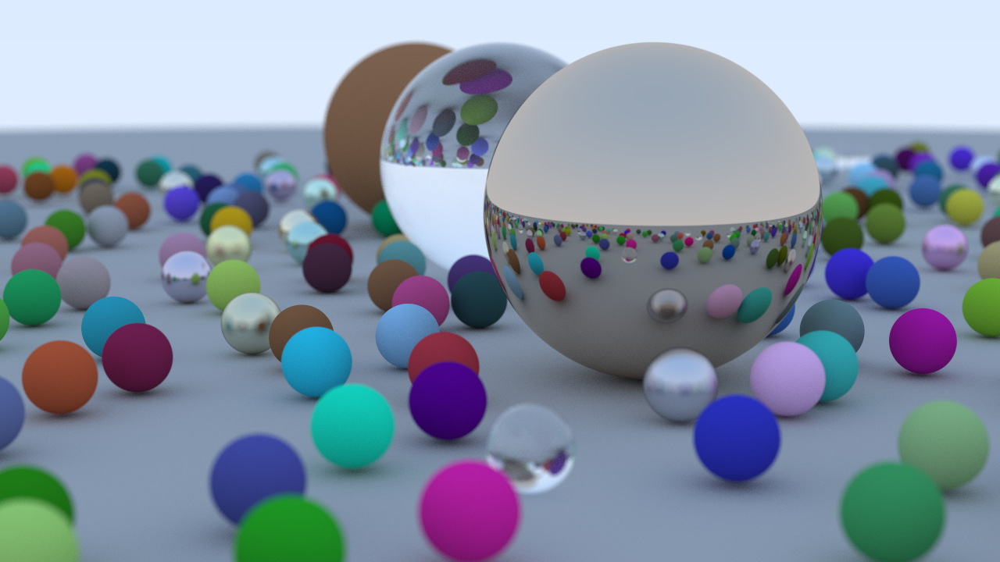
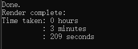
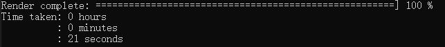
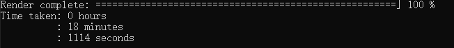

# MyRayTracer
无外部库依赖
## 如何运行？
- 运行 `GenerateProject.bat`
- 在visual studio 2022中运行即可
## 运行结果


## 多线程加速
### 参数1
```
Width = 400;
Height = 225;
SPP = 100;
maxDepth = 50;
```
#### 单线程

#### 多线程（Intel i7-12700 20线程）


### 参数2
```
Width = 1280;
Height = 720;
SPP = 500;
maxDepth = 50;
```
#### 单线程
3小时以上
#### 多线程（Intel i7-12700 20线程）
