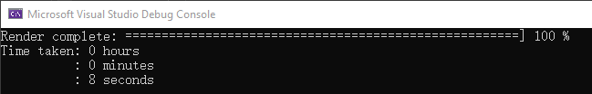
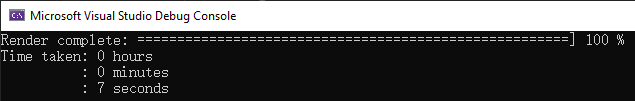
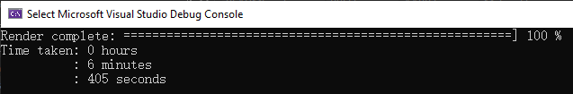
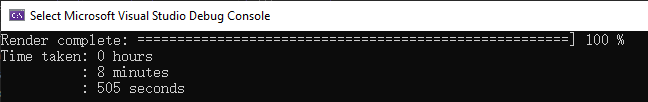
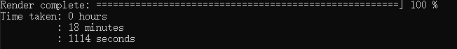

# MyRayTracer (next week)
无外部库依赖
## 如何运行？
- 运行 `GenerateProject.bat`
- 在visual studio 2022中运行即可
## 运行结果 (加上了运动模糊和 BVH)


## 参数1
```
Width = 400;
Height = 225;
SPP = 100;
maxDepth = 50;
```

### BVH加速后


### BVH再优化后 (稍微有所提升)


### BVH加速前


## 参数2
```
Width = 1280;
Height = 720;
SPP = 500;
maxDepth = 50;
```

### BVH加速后


### BVH再优化后 (不知道为什么反而变慢了)


### BVH加速前

